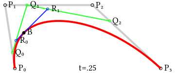

Часы с погодой и автоматической синхронизацией времени
======================================================

# Особенности

## Изображение
  1. Цифры написаны шрифтом, похожим на рукописный;
  2. Cмена цифр происходит с анимацией 30 кадров в секунду;
  3. Анимация длится половину секунды и начинается за пол-секунды до 
     наступления анимируемого времени;
  4. Цвет изображения погоды зависит от температуры;
  5. Для улучшения визуального восприятия граничные точки сглаживаются;
  6. Температура рисуется теми же цифрами, что и время.
  
## Реализация
  1. Используется микроконтроллер [ESP32](https://esphome.io/devices/nodemcu_esp32.html);
  2. В данной реализации использован дисплей 320x240 на контроллере ILI9341;
  3. Использованная графическая библиотека написана целиком самостоятельно;
  4. Графическая библиотека поддерживает другие распространённые контроллеры,
     может одновременно использовать несколько дисплеев;
  5. Графическая библиотека поддерживает не только физические, но и виртуальные
     экраны, которые затем можно комбинировать и выводить на физический экран;
  6. Шрифты поддерживают произвольный набор `Code point`-ов, можно выводить 
     произвольный `UTF-8` текст.
     
## Анимация
  1. Каждая цифра представляет из себя набор из трёх кубических кривых Безье;
  2. Каждая кубическая кривая Безье требует 4 опорных точки для рисования;
  3. Многие цифры могли быть изображены только двумя кривыми, но это 
     ограничивает возможный путь кривой линии, он может уже не всегда попадать
     в желаемый, особенно для цифр 2 и 5;
  4. Для трансформации одной цифры в другую точки каждой кривой линейно 
     перемещаются в соответсвующие точки результирующей кривой;
  5. После рисования всех необходимых элементов в виртуальных экранах происходит 
     расчёт сколько осталось свободного времени от отведённой 1/30 секунды и 
     задача отрисовки засыпает на этот остаток времени, передавая упраление 
     задаче вывода на физический экран.

## Синхронизация времени и получение местоположения
  1. После запуска микроконтроллера запускается процесс соединения с точной доступа;
  2. После успешного получения IP от точки доступа, запускается процесс 
     периодического получения местоположения и процесс синхронизации времени с 
     публичным NTP сервером;
  3. Для получения местоположения используется сервис [ipinfo.io](https://ipinfo.io);
  4. После получения местоположения, запускается процесс получения погоды с сервера
     [openweathermap.org](https://openweathermap.org/);
  5. Получение местоположения позволяет определить временную зону для времени;
  6. Опрос местоположения и погоды происходит каждые 10 минут.
   
# Подробности

Кубические кривые Безье позволяют описать плавную кривую с двумя изгибами между
крайними точками .
Этот класс кривых описан подробно описан в многочисленной литературе, а так же, в
[Википедии](https://ru.wikipedia.org/wiki/%D0%9A%D1%80%D0%B8%D0%B2%D0%B0%D1%8F_%D0%91%D0%B5%D0%B7%D1%8C%D0%B5).

Каждая цифра описывается тремя кривыми Безье. Для определённости, я мысленно расставлял 
точки на поле 100х160, не используя никакого визуального инструмента. Получившиеся
символы в итоге напоминают рукописный шрифт, который, как мне говорит моя жена, очень
похож на мой собственный. Первая цифра, на которой я тренировался, была `2`. Она состоит
из трёх элементов: верхний полукруг, извилистая "шейка" и основание. Эту цифру я хотел 
сделать именно такой, поэтому, мне потребовалось три кривых. На большинство цифр
хватило бы и двух кривых, так что пришлось третью пристраивать куда-нибудь в любом случае.
Координаты некоторых кривых выходят за рамки поля 100х160, но сами кривые при этом 
остаются внутри.

Для рисования цифр заданного размера используется операция афинного преобразования
"масштабирование и сдвиг". Координаты точек в поле 100х160 масштабируется в желаемые
размеры и сдвигаются на нужный вектор для рисования кривых. 

Кривые рисуются отрезками прямых по сегментам. Каждая кривая разбита на 12 сегментов.
Чисто подбиралось экспериментально, чтобы, с одной стороны, не создавалось проблем с
быстродействием, а с другой, всё выглядело ещё достаточно плавным. Так же, все 
нарисованные элементы ещё дополнительно сглаживаются алгоритмом антиалиасинга, который
для чёрных точек на границах элементов создаёт гладкий переход. 

Для рисования толстых кривых используются толстые линии, которые, фактически, 
повёрнутые прямоугольники. Алгоритм рисования толстых линий оптимизирован под
особенности передачи данных на экран. Если линии становятся заметно толстыми, то на изгибах
кривых могут появляться разрывы на внешней стороне изгиба. Чтобы это избежать, между
сегментами для толстых кривых рисуются сплошные круги, которые заглаживают эти разрывы.

Все элементы рисуются в соответствующих виртуальных экранах, которые затем передаются
в основной процесс для отображения на физическом экране. Таким образом, разные процессы
не будут конфликтовать за шину SPI. 

Для простоты реализации алгоритма антиалиасинга, все используемые виртуальные экраны
8-битные, где каждый байт означает интенсивность цвета. При переносе 8-битного
виртуального экрана на физический, используется таблица трансляции цвета в 16-битное
представление. Для погоды и времени используются отдельные таблицы, для погоды она
расчитывается каждый раз при изменении температуры. 

Символы погоды берутся из шрифта [Weather Icons](https://erikflowers.github.io/weather-icons/).
Они немного не совпадают с той формой погоды, что возвращает сервис погоды, пришлось
творчески придумать отображение.

