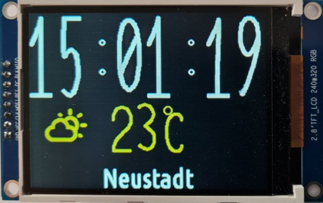
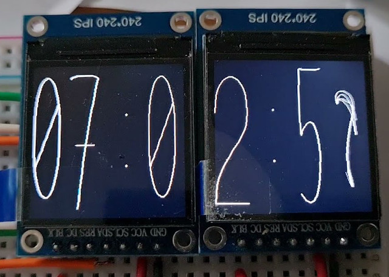
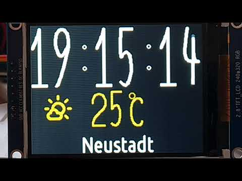

Clock with weather and automatic time synchronization
=====================================================

# Features

## Display
  1. The numbers are written in a font similar to handwritten;
  2. The change of numbers occurs with animation of 30 frames per second;
  3. The animation lasts half a second and starts half a second before
     the onset of the animated time;
  4. The color of the weather image depends on the temperature;
  5. To improve visual perception, the boundary points are smoothed;
  6. Temperature is drawn with the same numbers as time.
  
## Implementation
  1. Microcontroller [ESP32](https://esphome.io/devices/nodemcu_esp32.html) is used;
  2. This implementation uses a 320x240 display on the ILI9341 controller;
  3. The graphics library used was written entirely by me;
  4. The graphics library supports other common controllers, and it
     can use multiple displays at the same time;
     
     
     
  5. The graphics library supports not only physical, but also virtual
     screens that can then be combined and displayed on a physical screen;
  6. Fonts support an arbitrary set of `Code points`, you can output
     arbitrary `UTF-8` text.
     
## Animation
  1. Each digit is a set of three cubic Bezier curves [link](https://github.com/jef-sure/ili9341_dgx/blob/main/main/main.c#L86);
  2. Each cubic Bézier curve requires 4 anchor points to draw;
  3. Many numbers could be depicted with only two curves, but this
     limits the possible path of the curved line, it may no longer always hit
     into the desired one, especially for the numbers 2 and 5;
  4. To morph one digit to another point of each curve linearly
     move to the corresponding points of the resulting curve [link](https://github.com/jef-sure/ili9341_dgx/blob/main/main/main.c#L392);
  5. After drawing all the necessary elements in the virtual screens, the
     calculating how much free time is left from the allotted 1/30 second and
     the drawing task sleeps for this remainder of time, passing control
     the task of displaying on a physical screen.

## Time sync and get location
  1. After starting the microcontroller, the process of connecting to the exact access starts;
  2. After successfully obtaining IP from the access point, the process starts
     periodic position acquisition and the process of time synchronization with
     public NTP server;
  3. To obtain the location, the [ipinfo.io] service (https://ipinfo.io) is used;
  4. After receiving the location, the process of receiving weather from the server starts
     [openweathermap.org] (https://openweathermap.org/);
  5. Getting the location allows you to define the time zone for the time;
  6. Polling of location and weather occurs every 10 minutes.
   
# Details

Cubic Bézier curves allow you to describe a smooth curve with two bends between
endpoints ![example from wikipedia] (./360px-Bézier_3_big.svg.png "curve example").
This class of curves is described in detail in numerous literature, as well as, in
[Wikipedia](https://en.wikipedia.org/wiki/B%C3%A9zier_curve).

Each digit is described by three Bezier curves. To be specific, I mentally arranged
points on a 100x160 field without using any visual tool. The resulting
characters end up like a handwritten script, which my wife tells me is very
similar to my own. The first number I trained on was `2`. It consists
of three elements: the upper semicircle, the winding "neck" and the base. This figure I wanted
to do just that, therefore, it took me three curves. For most numbers
two curves would be enough, so I had to attach a third somewhere in any case.
The coordinates of some curves go beyond the field 100x160, but the curves themselves
stay inside.

To draw numbers of a given size, the affine transformation operation
"scaling and shifting" is used. The coordinates of the points in the field 100x160 are scaled to the desired
dimensions and shifted by the desired vector for drawing curves.

Curves are drawn by line segments. Each curve is divided into 12 segments.
It was carefully selected experimentally so that, on the one hand, there were no problems with
performance, but on the other hand, everything still looked quite smooth. All
drawn elements are additionally smoothed by the anti-aliasing algorithm, which
for black dots on element borders creates a smooth transition.

Thick lines are used to draw thick curves, which are, in fact,
rotated rectangles. The algorithm for drawing thick lines is optimized for
features of data transfer to the screen. If the lines become noticeably thick, then on the bends
curves, breaks may appear on the outside of the bend. To avoid this, between
the thick curve segments solid circles are drawn to fill these gaps.

All elements are drawn on their respective virtual screens, which are then passed
into the main process for displaying on a physical screen. Thus, different processes
will not conflict over the SPI bus.

For ease of implementation of the anti-aliasing algorithm, all used virtual screens
8-bit, where each byte represents the intensity of the color. To display 8-bit
virtual screen to 16 bit physical one, a color translation table (LUT) is used. 
Separate LUTs are used for weather and time, for weather it is
calculated every time the temperature changes.

The weather symbols are taken from the [Weather Icons](https://erikflowers.github.io/weather-icons/) font.
They are slightly different from the information that the weather service returns, I had to
come up with a display solution creatively.

Short youtbe video:

